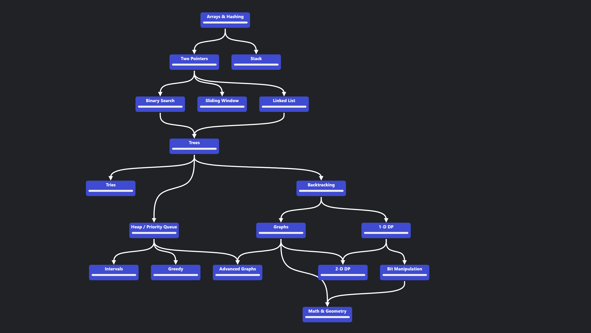

# Coding Interview Tips

Preparing for coding interviews can be daunting, but with the right strategies, you can excel. This guide provides actionable tips to help you succeed in technical interviews at top tech companies (FAANG and beyond). Whether you're a beginner or seasoned coder, these tips will sharpen your skills and boost your confidence.

---
1. https://takeuforward.org/strivers-a2z-dsa-course/strivers-a2z-dsa-course-sheet-2/
2. https://chunhthanhde.gitbook.io/leetcode-top-interview
3. https://wentao-shao.gitbook.io/leetcode
4. https://neetcode.io/practice?tab=neetcode150

---

## Table of Contents
1. [Before the Interview](#before-the-interview)
2. [During the Interview](#during-the-interview)
3. [After the Interview](#after-the-interview)
4. [General Tips](#general-tips)
5. [Recommended Resources](#recommended-resources)

---

## Before the Interview

### 1. Master Key Data Structures and Algorithms
- **Focus Areas**: Arrays, Linked Lists, Stacks, Queues, Hash Maps, Trees, Graphs, Heaps, Sorting, Searching, Dynamic Programming, Greedy.
- **Tip**: Understand time and space complexity (Big-O notation) for each operation.
- **Practice**: Solve problems on LeetCode, HackerRank, or Codeforces (e.g., Two Pointers, Sliding Window, DFS/BFS).

### 2. Practice Problem-Solving Patterns
- Learn common patterns: Two Pointers, Sliding Window, Binary Search, DFS/BFS, Dynamic Programming, Greedy, Backtracking.
- **Example**: For "Two Sum" (LeetCode #1), practice both hash map (O(n)) and two-pointer (O(n log n)) solutions.
- **Goal**: Recognize patterns quickly to apply them to new problems.

### 3. Build a Study Plan
- **Duration**: 4-8 weeks, depending on experience.
- **Structure**:
    - Week 1-2: Arrays, Strings, Two Pointers
    - Week 3: Binary Search, Sorting
    - Week 4: Trees, Graphs
    - Week 5: Dynamic Programming
    - Week 6: Review & Mock Interviews
- **Daily Goal**: 2-3 problems, 1-2 hours.

### 4. Simulate Real Conditions
- Use a timer (20-30 minutes/problem).
- Practice on a whiteboard or text editor without autocomplete.
- Test with edge cases (empty input, single element, large data).

### 5. Understand the Company
- Research common question types (e.g., Google loves graph problems, Amazon favors system design).
- Tailor practice to the company’s tech stack or problem domains.

---

## During the Interview

### 1. Clarify the Problem
- Restate the problem to confirm understanding.
- Ask about input constraints (size, range, type).
- Example: "Can the array contain duplicates? Is it sorted?"

### 2. Think Aloud
- Explain your thought process step-by-step.
- Start with a brute-force solution, then optimize.
- Example: "I’ll first try a nested loop (O(n²)), but let’s see if a hash map can reduce it to O(n)."

### 3. Write Pseudocode First
- Outline your approach before coding.
- Example: Initialize hash map
  For each element: Check if complement exists
  If yes, return indices.Else, add to map

- Verify with interviewer before proceeding.

### 4. Code Cleanly
- Use meaningful variable names (e.g., `leftPointer` vs. `i`).
- Handle edge cases explicitly.
- Comment complex logic.

### 5. Test Your Solution
- Walk through with a small example (e.g., `[2, 7, 11, 15], target = 9`).
- Check boundary conditions (empty input, max values).
- Verify time/space complexity (e.g., "This runs in O(n) time, O(n) space").

### 6. Optimize if Time Allows
- Discuss trade-offs (e.g., space vs. time).
- Suggest alternatives (e.g., "We could use a sorted array approach for O(n log n) with O(1) space").

### 7. Stay Calm and Communicate
- If stuck, backtrack to your last clear step.
- Ask for hints politely: "Could you nudge me toward a more efficient approach?"

---

## After the Interview

### 1. Reflect on Performance
- Note what went well (e.g., clear explanation) and what didn’t (e.g., missed edge case).
- Revisit the problem later to solidify understanding.

### 2. Review Solutions
- Compare your approach with optimal solutions (LeetCode Discuss, NeetCode).
- Analyze time/space complexity differences.

### 3. Follow Up
- Send a thank-you email if appropriate (e.g., for recruiter-led processes).
- Clarify next steps if not provided.

---

## General Tips

### 1. Consistency is Key
- Practice daily, even if just one problem.
- Gradually increase difficulty (Easy → Medium → Hard).

### 2. Focus on Weaknesses
- Struggling with DP? Spend extra time on classics like "Climbing Stairs" (#70).
- Track progress with a spreadsheet or LeetCode stats.

### 3. Learn from Mistakes
- Keep a log of errors (e.g., off-by-one, overflow).
- Revisit failed problems after a week.

### 4. Master One Language
- Pick a language (e.g., Java, Python, C++) and know its libraries (e.g., Java’s `HashMap`, `PriorityQueue`).
- Avoid switching mid-preparation.

### 5. Mock Interviews
- Use platforms like Pramp, Interviewing.io, or LeetCode Premium.
- Practice with peers or mentors.

### 6. Time Management
- Allocate 5 min to understand, 10 min to plan, 15 min to code/test for a 30-min problem.
- Move on if stuck after 20 min during practice.

---

## Recommended Resources

### Websites
- **LeetCode**: Practice problems by pattern/topic (NeetCode 150 recommended).
- **HackerRank**: Beginner-friendly challenges.
- **Codeforces**: Competitive programming for advanced skills.

### Books
- *"Cracking the Coding Interview"* by Gayle Laakmann McDowell: 189 problems with solutions.
- *"Introduction to Algorithms"* by Cormen (CLRS): Deep dive into theory.

### Videos
- **NeetCode**: Clear explanations with visuals.
- **Tech With Tim**: Beginner-friendly tutorials.
- **Abdul Bari**: Algorithm fundamentals.

### Tools
- **GitHub**: Store solutions for review.
- **Online IDEs**: LeetCode’s editor, Repl.it for quick testing.

---

## Final Thoughts
Success in coding interviews comes from preparation, practice, and persistence. Start early, stay disciplined, and treat every mistake as a learning opportunity. You’ve got this—good luck!

*Last Updated: March 08, 2025*

